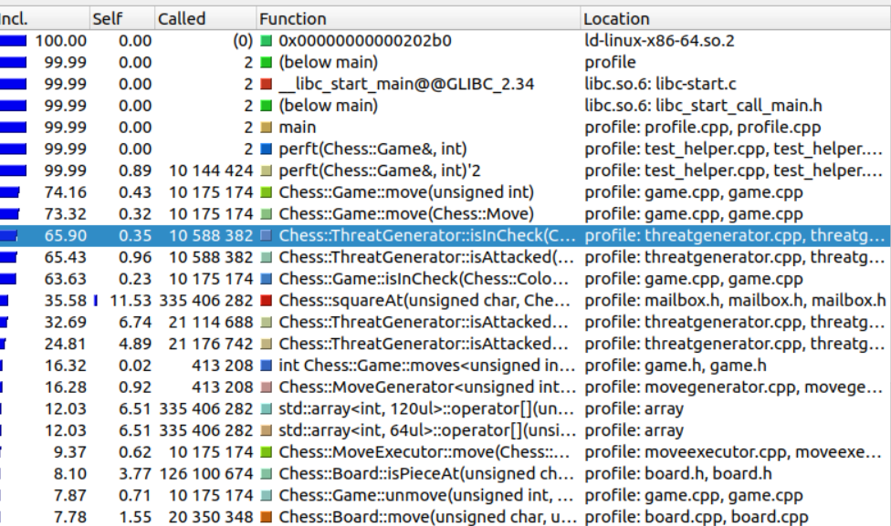
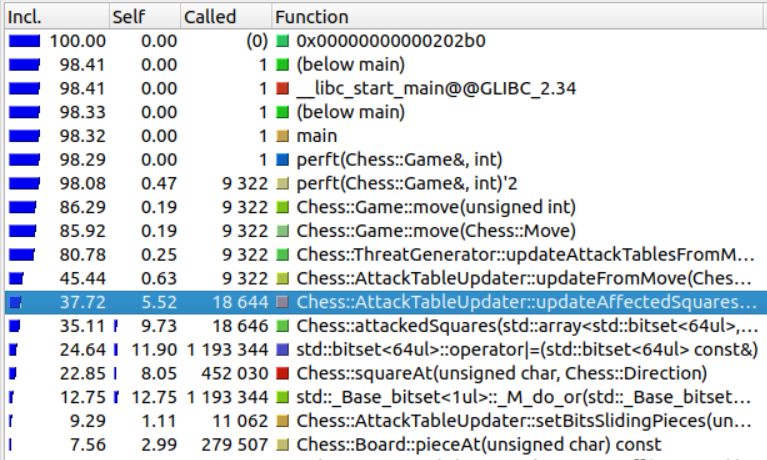

## Perft Results

Iteration 0:
+ Standard mailbox board representation and algorithms

| Depth  | T1 (ms)   | T2 (ms)   | T3 (ms)   | Avg (ms)   |
|--------|-----------|-----------|-----------|------------|
| 1      | 0         | 0         | 0         | 0          |
| 2      | 0         | 0         | 0         | 0          |
| 3      | 10        | 10        | 10        | 10         |
| 4      | 152       | 152       | 153       | 152.33     |
| 5      | 3484      | 3476      | 3479      | 3479.67    |
| 6      | 86421     | 86257     | 86089     | 86255.67   |      
| 7      | ~24000000 | -         | -         | ~24000000  |

Main bottleneck is `isInCheck()`:

Iteration 1:
+ Mailbox board representation
+ Maintain attack tables mainly for determining checks

| Depth  | T1 (ms)   | T2 (ms)   | T3 (ms)   | Avg (ms)   |
|--------|-----------|-----------|-----------|------------|
| 1      | 0         | 0         | 0         | 0          |
| 2      | 0         | 0         | 0         | 0          |
| 3      | 21        | 18        | 20        | 19.67      |
| 4      | 294       | 295       | 296       | 295        |
| 5      | 7422      | 7275      | 7315      | 7337.33    |
| 6      | 177370    | -         | -         | 177370     |      
| 7      | -         | -         | -         | -          |

Main bottleneck is `updateAttackTables()`.

Expected this to be faster  than iteration 0...
+ Would a custom bitset class be more efficient than std::bitset?
+ Is work repeated by updating atk tables and move generation?
+ Can we improve algorithm for updating atk tables?
+ Can we improve algorithm for computing checks using from attack tables?
+ Should we use two types of attack tables: atk_from and atk_to? If we did this, then for sure a lot of work would be shared with move generation. So move generation algorithms should be changed to take advantage of the attack tables. To further complicate this, std::bitset does not allow use to determine the position of set bits, so a custom bitset class would be required.
